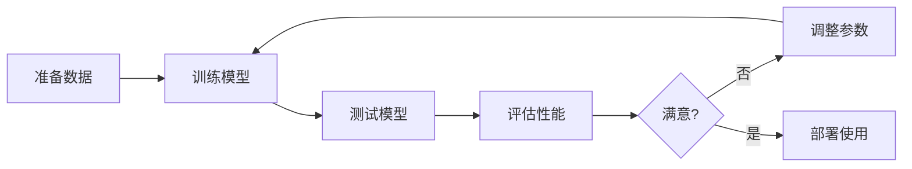

# 诗词创作指令微调 - 完整实现

> @Author xiaomin.zhang  
> 创建日期: 2026-02-13

---

## 🎯 项目简介

本项目提供了**完整的诗词创作指令微调解决方案**，包括：

- 📚 **详细的教程文档** - 从理论到实践的完整指南
- 🎨 **高质量示例数据** - 30条精选诗词训练样本
- 🔧 **实用工具脚本** - 数据处理、可视化、验证
- 🚀 **完整训练流程** - 训练、测试、评估一体化
- 📊 **自动化评估** - 多维度性能指标

---

## 📦 核心文件

### 🔧 训练相关脚本（3个）

| 文件 | 功能 | 说明 |
|------|------|------|
| **train_instruction_finetuning.py** | 训练脚本 | 完整的指令微调训练实现 |
| **test_instruction_model.py** | 测试脚本 | 测试训练好的模型 |
| **evaluate_instruction_model.py** | 评估脚本 | 评估模型性能指标 |

### 📖 文档（6个）

| 文件 | 说明 |
|------|------|
| **README_POETRY_FINETUNING.md** | 项目入口文档 |
| **docs/instruction_finetuning_tutorial.md** | 完整教程 |
| **docs/QUICKSTART_INSTRUCTION_FINETUNING.md** | 快速开始 |
| **docs/INSTRUCTION_FINETUNING_SCRIPTS_GUIDE.md** | 脚本使用指南 |
| **docs/POETRY_FINETUNING_SUMMARY.md** | 项目总结 |
| **data/poetry_instruction/README.md** | 数据集说明 |

### 📊 数据文件（7个）

| 文件 | 说明 |
|------|------|
| **data/poetry_instruction/train.jsonl** | 训练集（20条） |
| **data/poetry_instruction/val.jsonl** | 验证集（5条） |
| **data/poetry_instruction/test.jsonl** | 测试集（5条） |
| **data/poetry_instruction/train_alpaca.jsonl** | Alpaca格式 |
| **data/poetry_instruction/train_chatgpt.jsonl** | ChatGPT格式 |
| **data/poetry_instruction/metadata.json** | 元信息 |
| **data/poetry_instruction/README.md** | 数据说明 |

---

## 🚀 快速开始（5分钟）

### 第一步：查看数据

```bash
# 验证数据
python scripts/prepare_poetry_data.py

# 生成分析报告
python scripts/visualize_poetry_data.py
```

### 第二步：训练模型

```bash
# 开始训练（使用LoRA，节省内存）
python train_instruction_finetuning.py
```

### 第三步：测试模型

```bash
# 运行测试用例
python test_instruction_model.py --mode test

# 或交互式测试
python test_instruction_model.py --mode interactive
```

### 第四步：评估模型

```bash
# 完整评估
python evaluate_instruction_model.py
```

---

## 📖 详细使用说明

### 1. 训练脚本

**功能**：
- ✅ 支持多种预训练模型（Qwen、ChatGLM等）
- ✅ 支持LoRA高效微调
- ✅ 自动数据处理和验证
- ✅ TensorBoard可视化
- ✅ 梯度检查点节省内存

**基础用法**：
```bash
# 默认配置训练
python train_instruction_finetuning.py
```

**自定义配置**：
在脚本的 `main()` 函数中修改参数：

```python
# 模型参数
model_args = ModelArguments(
    model_name_or_path="Qwen/Qwen2-1.5B",  # 模型路径
    use_lora=True,                          # 使用LoRA
    lora_r=8,                               # LoRA秩
    lora_alpha=32                           # LoRA alpha
)

# 训练参数
training_args = TrainingArguments(
    output_dir="./output/poetry_instruction_model",
    num_train_epochs=3,                     # 训练轮数
    per_device_train_batch_size=2,          # 批次大小
    learning_rate=5e-5,                     # 学习率
    # ... 更多参数
)
```

**监控训练**：
```bash
# 启动TensorBoard
tensorboard --logdir ./output/poetry_instruction_model/logs
```

---

### 2. 测试脚本

**功能**：
- ✅ 三种测试模式（测试用例、交互式、参数对比）
- ✅ 支持LoRA模型
- ✅ 可调节生成参数

**测试用例模式**：
```bash
python test_instruction_model.py \
    --model_path ./output/poetry_instruction_model \
    --mode test
```

**交互式模式**：
```bash
python test_instruction_model.py \
    --model_path ./output/poetry_instruction_model \
    --mode interactive
```

示例交互：
```
请输入指令: 写一首关于春天的五言绝句
输入额外信息（可选，直接回车跳过）: 

生成中...

------------------------------------------------------------
生成结果:
------------------------------------------------------------
春风拂柳绿，
燕子绕梁飞。
桃花三月雨，
诗意满园归。
------------------------------------------------------------
```

**参数对比模式**：
```bash
python test_instruction_model.py \
    --model_path ./output/poetry_instruction_model \
    --mode compare
```

---

### 3. 评估脚本

**功能**：
- ✅ 自动评估测试集
- ✅ 多维度评估指标（格式准确率、BLEU、字符准确率）
- ✅ 生成详细报告

**基础用法**：
```bash
python evaluate_instruction_model.py \
    --model_path ./output/poetry_instruction_model \
    --test_file data/poetry_instruction/test.jsonl \
    --output_dir ./output/evaluation
```

**评估指标**：
- **格式准确率**: 是否符合诗词格律
- **BLEU分数**: 与参考诗词的相似度
- **字符准确率**: 字符重叠率

**输出文件**：
- `evaluation_results.json` - JSON格式结果
- `evaluation_report.md` - Markdown格式报告

---

## 📊 数据集详情

### 基本信息

| 项目 | 数值 |
|------|------|
| 总样本数 | 30条 |
| 训练集 | 20条 (66.7%) |
| 验证集 | 5条 (16.7%) |
| 测试集 | 5条 (16.7%) |
| 验证通过率 | 100% |

### 诗词类型分布

- 五言绝句: 46.7%
- 七言绝句: 33.3%
- 五言律诗: 10.0%
- 七言律诗: 3.3%
- 古体诗: 6.7%

### 数据格式

```json
{
  "instruction": "写一首描写春天的五言绝句",
  "input": "",
  "output": "春风拂柳绿，\n燕子绕梁飞。\n桃花三月雨，\n诗意满园归。",
  "metadata": {
    "poem_type": "五言绝句",
    "style": "清新",
    "season": "春",
    "difficulty": "初级"
  }
}
```

---

## 🎯 完整工作流程



### 详细步骤

#### 1. 准备数据
```bash
# 验证数据格式
python scripts/prepare_poetry_data.py

# 生成可视化分析
python scripts/visualize_poetry_data.py

# 查看分析报告
cat data/poetry_instruction/analysis/train_report.md
```

#### 2. 训练模型
```bash
# 开始训练
python train_instruction_finetuning.py

# 监控训练（另开终端）
tensorboard --logdir ./output/poetry_instruction_model/logs
```

#### 3. 测试模型
```bash
# 快速测试
python test_instruction_model.py --mode test

# 交互式测试
python test_instruction_model.py --mode interactive
```

#### 4. 评估性能
```bash
# 完整评估
python evaluate_instruction_model.py

# 查看报告
cat output/evaluation/evaluation_report.md
```

#### 5. 调整优化
根据评估结果调整参数：
- 学习率
- 训练轮数
- 批次大小
- LoRA参数

#### 6. 部署使用
将训练好的模型部署到生产环境

---

## 🔧 配置说明

### 模型选择

| 模型 | 参数量 | GPU内存 | 推荐场景 |
|------|--------|---------|----------|
| Qwen2-0.5B | 0.5B | 4GB | 快速测试 |
| Qwen2-1.5B | 1.5B | 8GB | 平衡性能 |
| Qwen2-7B | 7B | 16GB+ | 最佳效果 |

### 训练参数

| 参数 | 默认值 | 说明 | 推荐范围 |
|------|--------|------|----------|
| learning_rate | 5e-5 | 学习率 | 1e-5 ~ 1e-4 |
| num_train_epochs | 3 | 训练轮数 | 3 ~ 10 |
| per_device_train_batch_size | 2 | 批次大小 | 1 ~ 8 |
| gradient_accumulation_steps | 8 | 梯度累积 | 4 ~ 16 |
| warmup_steps | 100 | 预热步数 | 总步数的10% |

### LoRA参数

| 参数 | 默认值 | 说明 |
|------|--------|------|
| lora_r | 8 | LoRA秩（越大表达能力越强） |
| lora_alpha | 32 | LoRA alpha（通常是r的4倍） |
| lora_dropout | 0.1 | Dropout率 |

---

## 📈 性能基准

### 训练时间（参考）

| 配置 | GPU | 数据量 | 时间 |
|------|-----|--------|------|
| LoRA + FP16 | RTX 3090 (24GB) | 20条 | ~5分钟 |
| LoRA + FP16 | RTX 3090 (24GB) | 1000条 | ~2小时 |
| 全参数 | A100 (40GB) | 1000条 | ~6小时 |

### 内存占用（参考）

| 配置 | 模型大小 | 内存占用 |
|------|----------|----------|
| Qwen2-1.5B + LoRA | 1.5B | ~6GB |
| Qwen2-7B + LoRA | 7B | ~16GB |
| Qwen2-7B 全参数 | 7B | ~32GB |

---

## 🐛 常见问题

### Q1: GPU内存不足？

**解决方案**：
```python
# 1. 启用LoRA
use_lora=True

# 2. 减小batch size
per_device_train_batch_size=1

# 3. 增加梯度累积
gradient_accumulation_steps=16

# 4. 启用梯度检查点
gradient_checkpointing=True

# 5. 减小序列长度
max_length=256
```

### Q2: 训练loss不下降？

**解决方案**：
```python
# 1. 调整学习率
learning_rate=1e-4  # 尝试更大的学习率

# 2. 增加warmup
warmup_steps=200

# 3. 检查数据质量
# 运行 prepare_poetry_data.py 验证数据

# 4. 增加训练轮数
num_train_epochs=5
```

### Q3: 生成结果不符合格律？

**解决方案**：
1. 增加训练数据（至少1000+条）
2. 在指令中强调格律要求
3. 增加训练轮数
4. 使用后处理验证格式

### Q4: 如何使用自己的数据？

1. 准备JSONL格式数据
2. 参考 `data/poetry_instruction/train.jsonl` 的格式
3. 修改脚本中的数据路径
4. 运行 `prepare_poetry_data.py` 验证

---

## 📚 文档索引

### 🌟 推荐阅读顺序

1. **新手入门**
   - [README_POETRY_FINETUNING.md](README_POETRY_FINETUNING.md) - 项目入口
   - [QUICKSTART_INSTRUCTION_FINETUNING.md](QUICKSTART_INSTRUCTION_FINETUNING.md) - 快速开始

2. **深入学习**
   - [instruction_finetuning_tutorial.md](instruction_finetuning_tutorial.md) - 完整教程
   - [INSTRUCTION_FINETUNING_SCRIPTS_GUIDE.md](INSTRUCTION_FINETUNING_SCRIPTS_GUIDE.md) - 脚本指南

3. **数据和总结**
   - [data/poetry_instruction/README.md](../data/poetry_instruction/README.md) - 数据集说明
   - [POETRY_FINETUNING_SUMMARY.md](POETRY_FINETUNING_SUMMARY.md) - 项目总结

---

## 🎉 总结

本项目提供了：

✅ **3个核心训练脚本** - 训练、测试、评估完整流程  
✅ **6份详细文档** - 从入门到精通  
✅ **30条示例数据** - 高质量训练样本  
✅ **2个工具脚本** - 数据处理和可视化  
✅ **完整的评估体系** - 多维度性能指标

**立即开始你的诗词创作AI之旅！** 🎨📝✨

---

<div align="center">

**[📖 完整教程](instruction_finetuning_tutorial.md)** | 
**[🚀 快速开始](QUICKSTART_INSTRUCTION_FINETUNING.md)** | 
**[🔧 脚本指南](INSTRUCTION_FINETUNING_SCRIPTS_GUIDE.md)** | 
**[📊 数据集](../data/poetry_instruction/README.md)**

Made with ❤️ by xiaomin.zhang

</div>
